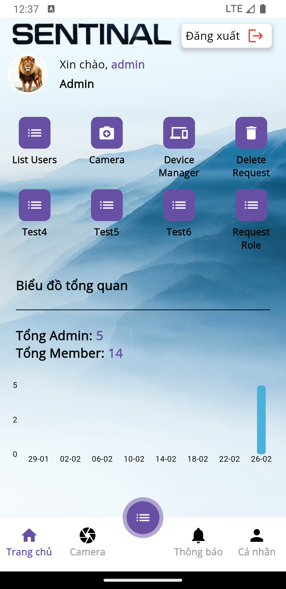
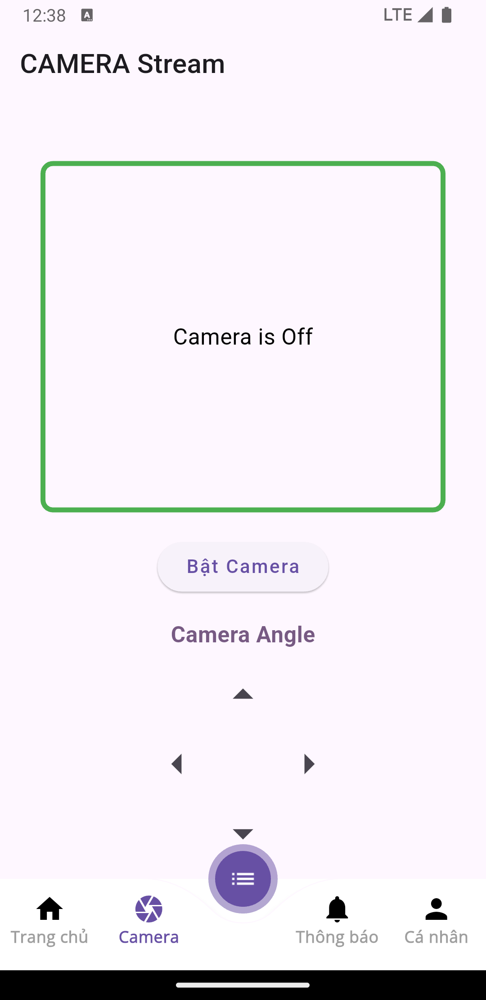
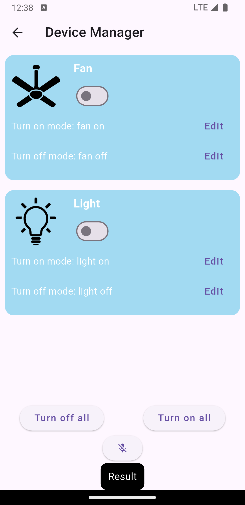
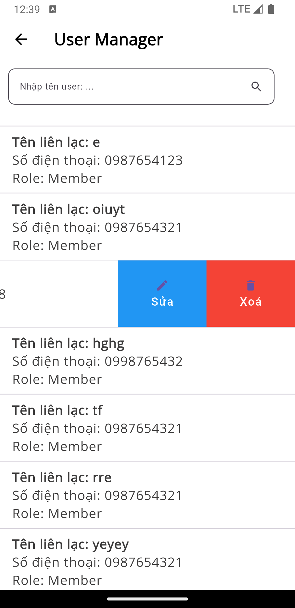
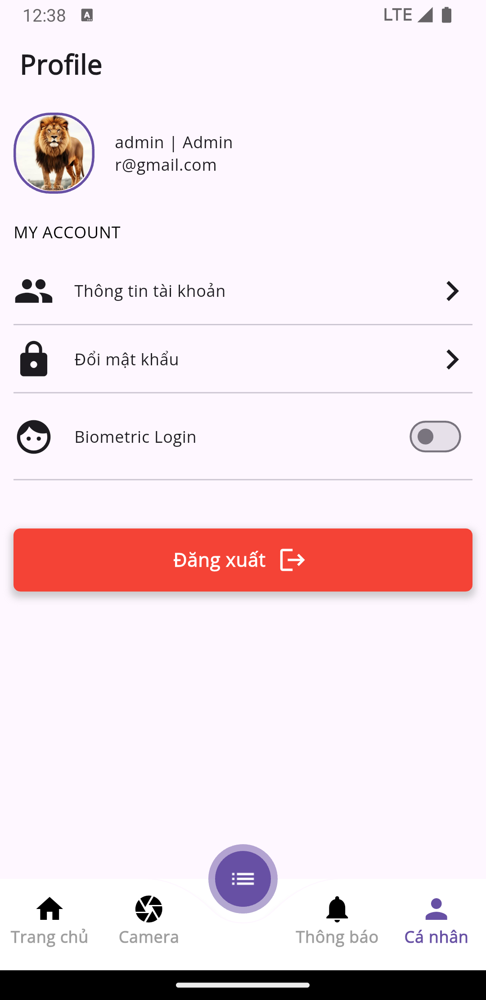
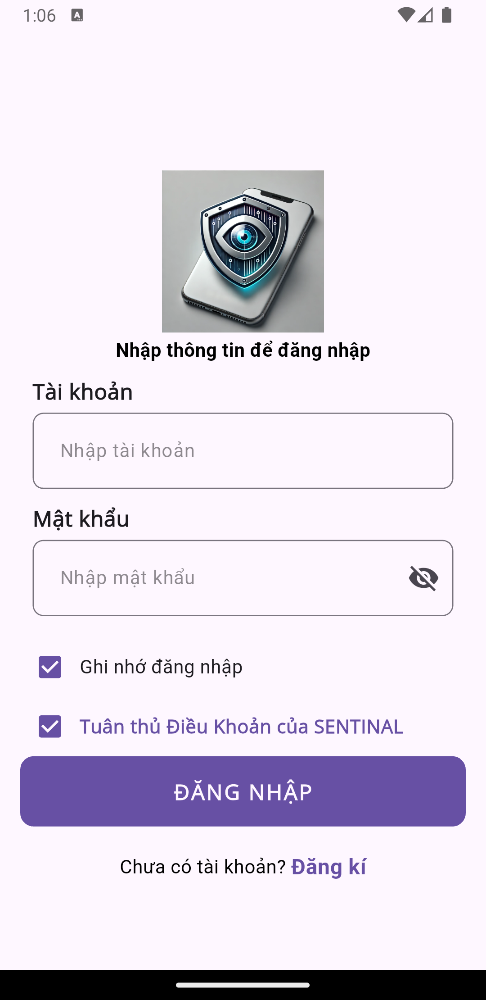
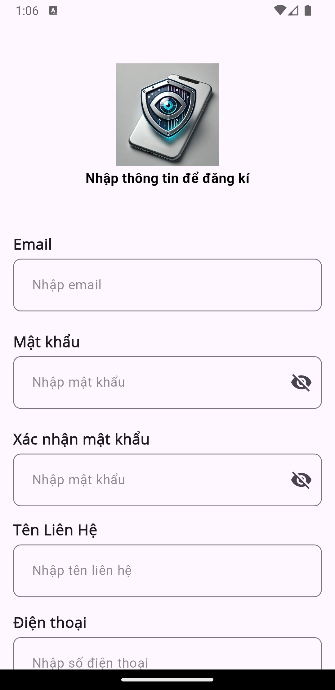
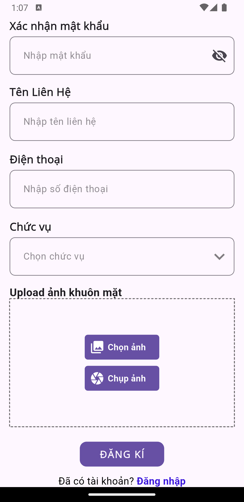

# Sentinal App

## Overview
Sentinal is a real-time monitoring and control application that provides user management, live camera streaming from an ESP32-CAM, and device control via buttons and voice commands. The app enables administrators to manage user permissions and interact with IoT devices seamlessly.

## Features
- **User Management**: Allows administrators to manage registered users, including editing and deleting user information.
- **Live Camera Streaming**: Displays a live feed from an ESP32-CAM with four directional control buttons for camera movement.
- **Device Control**: Users can control connected devices using physical buttons or customizable voice commands.
- **Home Dashboard**: Shows logged-in user information, navigation to other functional screens, and a user registration chart for the past 30 days.

## Screens

### 1. Home Screen
- Displays the logged-in user’s information.
- Provides navigation to different functionalities.
- Features a chart displaying the number of user registrations per day over the last 30 days.  


### 2. Camera Screen
- Streams live video from an ESP32-CAM.
- Includes four directional buttons to adjust the camera’s position.  


### 3. Device Manager Screen
- Allows users to control connected devices using on-screen buttons.
- Supports customizable voice commands to toggle device states.  


### 4. User Management Screen
- Displays a list of registered users.
- Enables administrators to edit or delete user information.  


### 5. Personal Info Screen
- Allows users to edit personal information.
- Enable fingerprint login and change passwords.  


### 6. SignIn and SignUp Screen  
  
  



## Technology Stack
- **Hardware**: ESP32-CAM, Servo
- **Mobile Framework**: Flutter
- **Backend**: Firebase
- **Database**: Firebase Realtime Database / Firestore

## Installation
1. Clone this repository:
   ```sh
   git clone https://github.com/your-repo/sentinal.git
   ```
2. Navigate to the project folder:
   ```sh
   cd sentinal-app
   ```
3. Install dependencies:
   ```sh
   flutter pub get
   ```
4. Run the application:
   ```sh
   flutter run
   ```

## Future Enhancements
- Integration with more IoT devices.
- Integration of facial recognition for user authentication via Face ID.
- Stranger detection functionality using ESP32-CAM..
- Multi-user role management for different permission levels.
